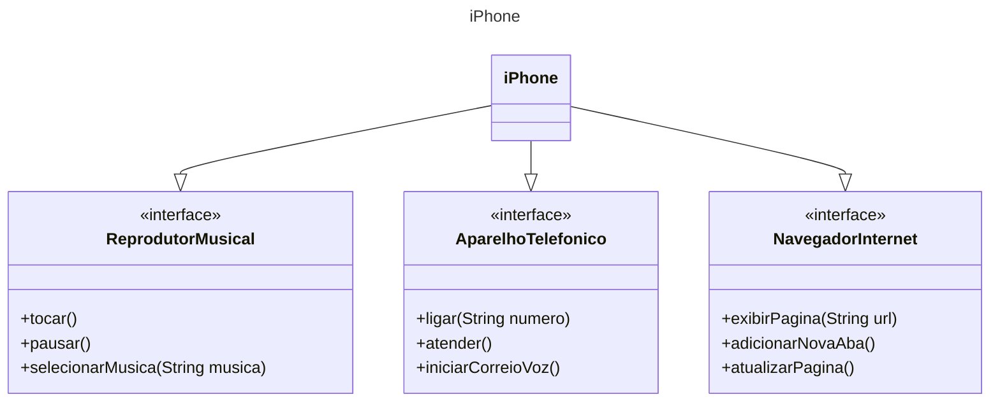

## Getting Started

Este é um desafio de projeto simples que consiste em modelar um iPhone com UML baseado nos [requisitos do projeto](https://github.com/digitalinnovationone/trilha-java-basico/tree/main/desafios/poo) e implementar suas classes de modo didático, isto é, sem a necessidade de implementar um algoritmo real.

## Project Structure

O código-fonte do projeto se encontra na página `src`, onde:

- `interfaces`: É a pasta que contém as interfaces que foram implementadas.
- `iPhone.java`: Contém a classe principal do projeto, que implementa as interfaces e seus métodos.
- `App.java`: É o arquivo principal do proejto, que instancia e implementa a classe `iPhone`

## UML

O código do projeto é baseado no seguinte UML:
